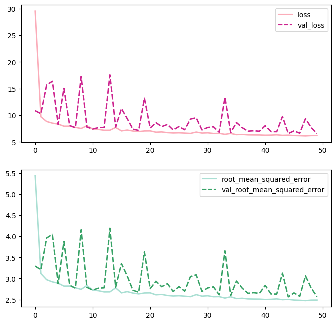

```python
import pandas as pd
import numpy as np
import matplotlib.pyplot as plt
import seaborn as sns
```

### **Import Data**


```python
train = np.load("data/train_matrix.npy")
train_label = np.load("data/train_labels.npy")
```


```python
test = np.load("data/test_matrix.npy")
test_labels = np.load("data/test_labels.npy")
```

### **Split training data into training and validtion set**


```python
from sklearn.model_selection import train_test_split
xtrain, xvalid, ytrain, yvalid = train_test_split(train, train_label, test_size=0.10, random_state=123) 
del train, train_label
```

### **Build sequential model**


```python
from tensorflow import keras
```


```python
model = keras.models.Sequential()
model.add(keras.layers.Flatten(input_shape = xtrain[0].shape))
model.add(keras.layers.Dense(100, activation="relu"))
model.add(keras.layers.Dense(100, activation="relu"))
model.add(keras.layers.Dense(100, activation="relu"))
model.add(keras.layers.Dense(1))
```


```python
model.summary()
```

    Model: "sequential_1"
    _________________________________________________________________
     Layer (type)                Output Shape              Param #   
    =================================================================
     flatten_1 (Flatten)         (None, 53)                0         
                                                                     
     dense_4 (Dense)             (None, 100)               5400      
                                                                     
     dense_5 (Dense)             (None, 100)               10100     
                                                                     
     dense_6 (Dense)             (None, 100)               10100     
                                                                     
     dense_7 (Dense)             (None, 1)                 101       
                                                                     
    =================================================================
    Total params: 25,701
    Trainable params: 25,701
    Non-trainable params: 0
    _________________________________________________________________


```python
opt = keras.optimizers.Adam(learning_rate=0.01)
model.compile(loss="mean_squared_error", optimizer=opt, metrics=[keras.metrics.RootMeanSquaredError()])
```

### **Train model**


```python
history = model.fit(xtrain, ytrain, 
          batch_size=10000, 
          epochs=50, 
          validation_data=(xvalid, yvalid))
```

    2022-08-21 14:46:28.346485: W tensorflow/core/framework/cpu_allocator_impl.cc:82] Allocation of 513062260 exceeds 10% of free system memory.


    Epoch 1/50
    243/243 [==============================] - 6s 18ms/step - loss: 29.5434 - root_mean_squared_error: 5.4354 - val_loss: 10.8538 - val_root_mean_squared_error: 3.2945
    Epoch 2/50
    243/243 [==============================] - 4s 17ms/step - loss: 9.7133 - root_mean_squared_error: 3.1166 - val_loss: 10.2948 - val_root_mean_squared_error: 3.2085
    Epoch 3/50
    243/243 [==============================] - 4s 17ms/step - loss: 8.8288 - root_mean_squared_error: 2.9713 - val_loss: 15.6914 - val_root_mean_squared_error: 3.9612
    Epoch 4/50
    243/243 [==============================] - 4s 17ms/step - loss: 8.5217 - root_mean_squared_error: 2.9192 - val_loss: 16.3832 - val_root_mean_squared_error: 4.0476
    Epoch 5/50
    243/243 [==============================] - 4s 17ms/step - loss: 8.3444 - root_mean_squared_error: 2.8887 - val_loss: 8.2712 - val_root_mean_squared_error: 2.8760
    Epoch 6/50
    243/243 [==============================] - 4s 18ms/step - loss: 7.9519 - root_mean_squared_error: 2.8199 - val_loss: 15.0543 - val_root_mean_squared_error: 3.8800
    Epoch 7/50
    243/243 [==============================] - 4s 17ms/step - loss: 7.9580 - root_mean_squared_error: 2.8210 - val_loss: 8.0714 - val_root_mean_squared_error: 2.8410
    Epoch 8/50
    243/243 [==============================] - 4s 17ms/step - loss: 7.7258 - root_mean_squared_error: 2.7795 - val_loss: 7.6667 - val_root_mean_squared_error: 2.7689
    Epoch 9/50
    243/243 [==============================] - 4s 17ms/step - loss: 7.5192 - root_mean_squared_error: 2.7421 - val_loss: 17.2893 - val_root_mean_squared_error: 4.1580
    Epoch 10/50
    243/243 [==============================] - 4s 18ms/step - loss: 8.0356 - root_mean_squared_error: 2.8347 - val_loss: 7.7853 - val_root_mean_squared_error: 2.7902
    Epoch 11/50
    243/243 [==============================] - 4s 18ms/step - loss: 7.4180 - root_mean_squared_error: 2.7236 - val_loss: 7.4255 - val_root_mean_squared_error: 2.7250
    Epoch 12/50
    243/243 [==============================] - 5s 19ms/step - loss: 7.3398 - root_mean_squared_error: 2.7092 - val_loss: 7.6747 - val_root_mean_squared_error: 2.7703
    Epoch 13/50
    243/243 [==============================] - 5s 19ms/step - loss: 7.1887 - root_mean_squared_error: 2.6812 - val_loss: 7.7187 - val_root_mean_squared_error: 2.7783
    Epoch 14/50
    243/243 [==============================] - 5s 20ms/step - loss: 7.1944 - root_mean_squared_error: 2.6822 - val_loss: 17.5838 - val_root_mean_squared_error: 4.1933
    Epoch 15/50
    243/243 [==============================] - 5s 19ms/step - loss: 7.7147 - root_mean_squared_error: 2.7775 - val_loss: 7.7990 - val_root_mean_squared_error: 2.7927
    Epoch 16/50
    243/243 [==============================] - 5s 19ms/step - loss: 7.0660 - root_mean_squared_error: 2.6582 - val_loss: 11.2551 - val_root_mean_squared_error: 3.3549
    Epoch 17/50
    243/243 [==============================] - 5s 19ms/step - loss: 7.2277 - root_mean_squared_error: 2.6884 - val_loss: 9.3850 - val_root_mean_squared_error: 3.0635
    Epoch 18/50
    243/243 [==============================] - 5s 19ms/step - loss: 7.0431 - root_mean_squared_error: 2.6539 - val_loss: 7.3998 - val_root_mean_squared_error: 2.7203
    Epoch 19/50
    243/243 [==============================] - 5s 19ms/step - loss: 6.9392 - root_mean_squared_error: 2.6342 - val_loss: 7.1549 - val_root_mean_squared_error: 2.6749
    Epoch 20/50
    243/243 [==============================] - 5s 19ms/step - loss: 7.0549 - root_mean_squared_error: 2.6561 - val_loss: 13.1986 - val_root_mean_squared_error: 3.6330
    Epoch 21/50
    243/243 [==============================] - 5s 19ms/step - loss: 7.0692 - root_mean_squared_error: 2.6588 - val_loss: 7.6039 - val_root_mean_squared_error: 2.7575
    Epoch 22/50
    243/243 [==============================] - 5s 19ms/step - loss: 6.8236 - root_mean_squared_error: 2.6122 - val_loss: 8.6182 - val_root_mean_squared_error: 2.9357
    Epoch 23/50
    243/243 [==============================] - 5s 19ms/step - loss: 6.8733 - root_mean_squared_error: 2.6217 - val_loss: 7.8689 - val_root_mean_squared_error: 2.8052
    Epoch 24/50
    243/243 [==============================] - 5s 19ms/step - loss: 6.7404 - root_mean_squared_error: 2.5962 - val_loss: 8.2769 - val_root_mean_squared_error: 2.8770
    Epoch 25/50
    243/243 [==============================] - 5s 19ms/step - loss: 6.6784 - root_mean_squared_error: 2.5843 - val_loss: 7.2375 - val_root_mean_squared_error: 2.6903
    Epoch 26/50
    243/243 [==============================] - 5s 20ms/step - loss: 6.7116 - root_mean_squared_error: 2.5907 - val_loss: 7.8841 - val_root_mean_squared_error: 2.8079
    Epoch 27/50
    243/243 [==============================] - 5s 19ms/step - loss: 6.6575 - root_mean_squared_error: 2.5802 - val_loss: 7.2814 - val_root_mean_squared_error: 2.6984
    Epoch 28/50
    243/243 [==============================] - 5s 19ms/step - loss: 6.5947 - root_mean_squared_error: 2.5680 - val_loss: 9.2816 - val_root_mean_squared_error: 3.0466
    Epoch 29/50
    243/243 [==============================] - 5s 19ms/step - loss: 6.8503 - root_mean_squared_error: 2.6173 - val_loss: 9.5300 - val_root_mean_squared_error: 3.0871
    Epoch 30/50
    243/243 [==============================] - 5s 19ms/step - loss: 6.6606 - root_mean_squared_error: 2.5808 - val_loss: 7.2505 - val_root_mean_squared_error: 2.6927
    Epoch 31/50
    243/243 [==============================] - 5s 19ms/step - loss: 6.7071 - root_mean_squared_error: 2.5898 - val_loss: 7.7068 - val_root_mean_squared_error: 2.7761
    Epoch 32/50
    243/243 [==============================] - 5s 19ms/step - loss: 6.5887 - root_mean_squared_error: 2.5668 - val_loss: 7.8498 - val_root_mean_squared_error: 2.8017
    Epoch 33/50
    243/243 [==============================] - 5s 19ms/step - loss: 6.6014 - root_mean_squared_error: 2.5693 - val_loss: 6.8236 - val_root_mean_squared_error: 2.6122
    Epoch 34/50
    243/243 [==============================] - 5s 19ms/step - loss: 6.4243 - root_mean_squared_error: 2.5346 - val_loss: 13.3763 - val_root_mean_squared_error: 3.6574
    Epoch 35/50
    243/243 [==============================] - 5s 19ms/step - loss: 6.5829 - root_mean_squared_error: 2.5657 - val_loss: 6.7333 - val_root_mean_squared_error: 2.5949
    Epoch 36/50
    243/243 [==============================] - 5s 19ms/step - loss: 6.3644 - root_mean_squared_error: 2.5228 - val_loss: 8.6420 - val_root_mean_squared_error: 2.9397
    Epoch 37/50
    243/243 [==============================] - 5s 19ms/step - loss: 6.4050 - root_mean_squared_error: 2.5308 - val_loss: 7.6761 - val_root_mean_squared_error: 2.7706
    Epoch 38/50
    243/243 [==============================] - 5s 20ms/step - loss: 6.3244 - root_mean_squared_error: 2.5148 - val_loss: 7.0155 - val_root_mean_squared_error: 2.6487
    Epoch 39/50
    243/243 [==============================] - 5s 20ms/step - loss: 6.3097 - root_mean_squared_error: 2.5119 - val_loss: 7.0935 - val_root_mean_squared_error: 2.6634
    Epoch 40/50
    243/243 [==============================] - 5s 19ms/step - loss: 6.3020 - root_mean_squared_error: 2.5104 - val_loss: 7.0023 - val_root_mean_squared_error: 2.6462
    Epoch 41/50
    243/243 [==============================] - 5s 19ms/step - loss: 6.2592 - root_mean_squared_error: 2.5018 - val_loss: 8.0457 - val_root_mean_squared_error: 2.8365
    Epoch 42/50
    243/243 [==============================] - 5s 19ms/step - loss: 6.2783 - root_mean_squared_error: 2.5057 - val_loss: 6.9266 - val_root_mean_squared_error: 2.6319
    Epoch 43/50
    243/243 [==============================] - 5s 19ms/step - loss: 6.3278 - root_mean_squared_error: 2.5155 - val_loss: 6.9198 - val_root_mean_squared_error: 2.6305
    Epoch 44/50
    243/243 [==============================] - 5s 19ms/step - loss: 6.2329 - root_mean_squared_error: 2.4966 - val_loss: 9.7845 - val_root_mean_squared_error: 3.1280
    Epoch 45/50
    243/243 [==============================] - 5s 19ms/step - loss: 6.2701 - root_mean_squared_error: 2.5040 - val_loss: 6.5713 - val_root_mean_squared_error: 2.5635
    Epoch 46/50
    243/243 [==============================] - 5s 20ms/step - loss: 6.1920 - root_mean_squared_error: 2.4884 - val_loss: 7.0669 - val_root_mean_squared_error: 2.6584
    Epoch 47/50
    243/243 [==============================] - 5s 21ms/step - loss: 6.1644 - root_mean_squared_error: 2.4828 - val_loss: 6.6379 - val_root_mean_squared_error: 2.5764
    Epoch 48/50
    243/243 [==============================] - 5s 21ms/step - loss: 6.1219 - root_mean_squared_error: 2.4742 - val_loss: 9.3733 - val_root_mean_squared_error: 3.0616
    Epoch 49/50
    243/243 [==============================] - 5s 19ms/step - loss: 6.1844 - root_mean_squared_error: 2.4868 - val_loss: 7.6773 - val_root_mean_squared_error: 2.7708
    Epoch 50/50
    243/243 [==============================] - 5s 19ms/step - loss: 6.1907 - root_mean_squared_error: 2.4881 - val_loss: 6.5943 - val_root_mean_squared_error: 2.5679


### **Loss**


```python
loss = pd.DataFrame(history.history)
loss.tail()
```


<div>
<table border="1" class="dataframe">
  <thead>
    <tr style="text-align: right;">
      <th></th>
      <th>loss</th>
      <th>root_mean_squared_error</th>
      <th>val_loss</th>
      <th>val_root_mean_squared_error</th>
    </tr>
  </thead>
  <tbody>
    <tr>
      <th>45</th>
      <td>6.192039</td>
      <td>2.488381</td>
      <td>7.066867</td>
      <td>2.658358</td>
    </tr>
    <tr>
      <th>46</th>
      <td>6.164404</td>
      <td>2.482822</td>
      <td>6.637872</td>
      <td>2.576407</td>
    </tr>
    <tr>
      <th>47</th>
      <td>6.121908</td>
      <td>2.474249</td>
      <td>9.373335</td>
      <td>3.061590</td>
    </tr>
    <tr>
      <th>48</th>
      <td>6.184372</td>
      <td>2.486840</td>
      <td>7.677322</td>
      <td>2.770798</td>
    </tr>
    <tr>
      <th>49</th>
      <td>6.190651</td>
      <td>2.488102</td>
      <td>6.594337</td>
      <td>2.567944</td>
    </tr>
  </tbody>
</table>
</div>


```python
fig, axes = plt.subplots(nrows=2,figsize=(8,8), dpi=100)
sns.lineplot(data=loss.loc[:,["loss","val_loss"]], palette="RdPu",linewidth=2.0, ax=axes[0]);
sns.lineplot(data=loss.loc[:,["root_mean_squared_error","val_root_mean_squared_error"]], palette="BuGn",linewidth=2.0, ax=axes[1]);
```





### **Prediction**


```python
model.evaluate(test, test_labels)
```


    28100/28100 [==============================] - 23s 825us/step - loss: 32.3987 - root_mean_squared_error: 5.6920


    [32.398651123046875, 5.691981315612793]


```python

```
