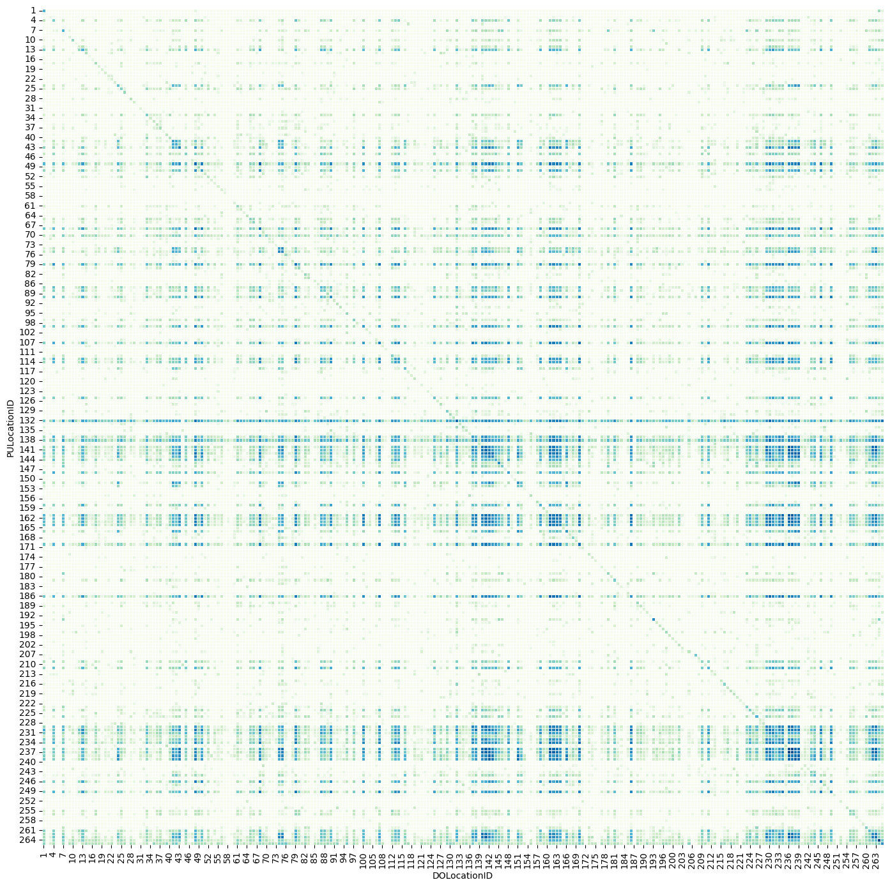
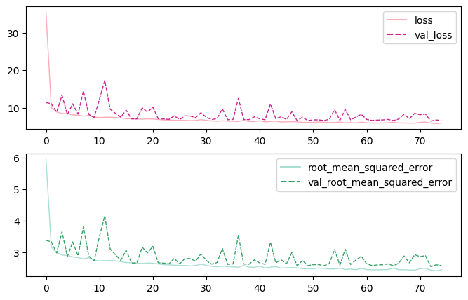

# **NYC Taxi Total Fair Prediction**

### **About**
*In this project we try to predict the `total fare` for NYC yellow taxis data provided by TLC Inc. We use `LightGBM` boosting framework and 
Keras `Deep Neural Network` to implement `regression` model. We use `Feature Engineering` to add new feature to the existing data 
to improve our model.To access the robustness of our models we use `root mean squared error`.*

### **Data**
*The data include all trips made by yellow taxis in New York City for the month of March 2022 provided by [TLC Inc.](https://www1.nyc.gov/site/tlc/about/tlc-trip-record-data.page) in parquet format.* 

### **Project Links**

||page_link|notebook|
|---|---|---|
|**Data Cleaning**|main|notebook|
|**Exploratory Data Analysis**|main|notebook|
|**Feature Engineering**|main|notebook|
|**Model1 (LightGBM)**|main|notebook|
|**Model2 (Keras ANN)**|main|notebook|

### **Trips frequency**

### **ANN loss**

### **Model Metrics**

|**Model**|**RMSE**|
|---|---|
|**LightGBM**|5.658210424618493|
|**Keras ANN**|5.751218795776367|

